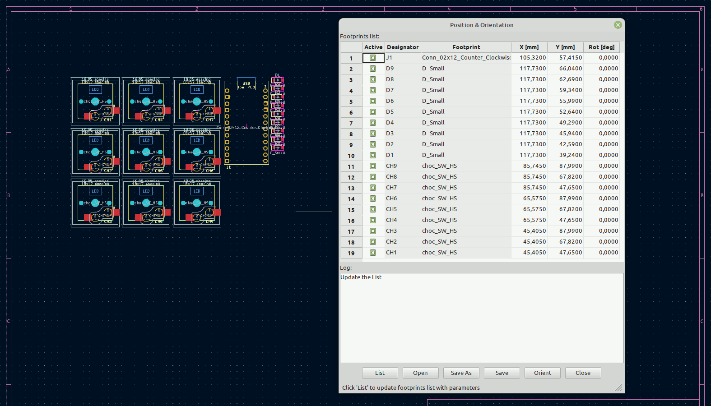

#  PosOrient

KiCad plugin for positioning and orientation of footprints

## Features

:white_check_mark: get footprints position and orientation \
:white_check_mark: work interactively, drag footprints and update data table \
:white_check_mark: go on the list to the footprint selected in the PCB editor \
:white_check_mark: set new position, orientation and update PCB editor \
:white_check_mark: sort data in the table by the columns \
:white_check_mark: save/open position, orientation configuration files \
:white_check_mark: check log for changes \
:white_check_mark: GUI highlighting and tooltips 

## Installation

PosOrient is part of the KiCad officiel repository. Simply open KiCad's `Plugin and Content Manager`, find the plugin in the repository, click `Install` and finally `Apply Pending Changes`.

To install the very latest version download the release package from the github on your local drive.
Open KiCad and the `Plugin and Content Manager`.
Click button `Install from File ...` and select the plugin zip package, `Apply Pending Changes`.

That's it, it's done!

The plugin should be available in the toolbar under the `PosOrient` icon: 
or selecting in the menu: `Tools -> External Plugins`

## Use from KiCad

Create schematic with assigned footprints to the symbols. Open `PCB Editor` and `Update PCB from Schematic`.
You can provide the footprints to the `PCB Editor` by any possible means.

Run the plugin from the toolbar, or menu. If the `PCB editor` contains footprints the dialog window of the plugin will fill the data table. Sort the table by columns, click on the column header. You can save and make backup of the data at any time. Drag the footprints in the main window with mouse, it's not necessary to close the plugin's dialog. Update new footprints positions in the data table with the `List` button. Click on the `Seleted` button to go on the list to the footprint selected in the PCB editor. Change position and orientation in the data table. Changed cells are marked with yellow color. To make changes take effect press the `Orient` button, yellow marking will be cleared. Use spread sheet, or any other useful tool to manipulate the saved data and read it back to the data table. Got lost what you did? Follow the log, or just read in the backup. It's simple as that!