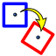
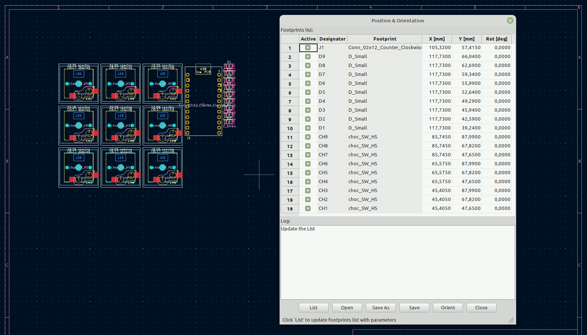

#  PosOrient

KiCad plugin for positioning and orientation of footprints

## Features

:white_check_mark: get footprints position and orientation \
:white_check_mark: work interactively, drag footprints and update data table \
:white_check_mark: go on the list to the footprint selected in the PCB editor \
:white_check_mark: set new position, orientation and update PCB editor \
:white_check_mark: work with footprints groups \
:white_check_mark: sort data in the table by the columns \
:white_check_mark: save/open position, orientation configuration files \
:white_check_mark: check log for changes \
:white_check_mark: GUI highlighting and tooltips 

## Installation

PosOrient is part of the KiCad officiel repository. Simply open KiCad's `Plugin and Content Manager`, find the plugin in the repository, click `Install` and finally `Apply Pending Changes`.

To install the very latest version download the release package from the github on your local drive.
Open KiCad and the `Plugin and Content Manager`.
Click button `Install from File ...` and select the plugin zip package, `Apply Pending Changes`.

That's it, it's done!

The plugin should be available in the toolbar under the `PosOrient` icon: 
or selecting in the menu: `Tools -> External Plugins`

## How to Use the Plugin from KiCad

Create schematic with assigned footprints to the symbols. Open `PCB Editor` and `Update PCB from Schematic`.  
You can provide the footprints to the `PCB Editor` by any possible means.

Run the plugin from the toolbar or menu.  
If the **PCB editor** contains footprints, the dialog window of the plugin will display a data table with their details.

Now you can:
- **Activate the footprints** by clicking on *Active* column header.
- **Sort the table** by clicking on column headers.
- **Save and make backups** of the data at any time.
- **Drag footprints** directly in the main PCB editor without closing the plugin.
- **Update the table** after moving footprints using the `List` button.
- **Jump to a footprint** selected in the PCB editor using the `Selected` button.
- **Change position/orientation** directly in the table — edited cells turn yellow until applied.
- **Work with footprints groups** create groups of footprints which are active and move them together.
- **Apply changes** with the `Orient` button (yellow highlight clears).
- **Manipulate saved data** in external tools like spreadsheets, then reload it into the table.
- **Restore state** from logs or saved backups if needed.

The plugin uses **tabbed interface** with three main sections: **File**, **Single**, and **Group**.

---

### 1. File Tab
This tab is for managing footprint data files.

| Button       | Description |
|--------------|-------------|
| **Open**     | Load a saved data file containing footprint positions and orientations. |
| **Save As**  | Save the current footprint data to a new file. |
| **Save**     | Save the current footprint data to the currently opened file. |
| **Close**    | Close the plugin window. |

---

### 2. Single Tab
This tab is for working with **individual footprints**.

| Button       | Description |
|--------------|-------------|
| **List**     | Refresh the table with the latest footprint data from the KiCad PCB Editor. |
| **Selected** | Jump to and highlight the footprint currently selected in the PCB editor. |
| **Orient**   | Apply the edited position/orientation from the table to the selected footprint. |

---

### 3. Group Tab
This tab is for working with **multiple footprints at once**.

| Button       | Description |
|--------------|-------------|
| **List**        | Refresh the table with the latest footprint data from the KiCad PCB Editor. |
| **Selected**    | Activate all currently selected footprints for group editing. |
| **Shift dX**    | Move all selected footprints by a specified distance along the X axis. |
| **Shift dY**    | Move all selected footprints by a specified distance along the Y axis. |
| **Revers X**    | Mirror all selected footprints across the X axis. |
| **Revers Y**    | Mirror all selected footprints across the Y axis. |
| **Rotate**      | Rotate all selected footprints by a specified angle (degrees). Positive values rotate counterclockwise. |
| **Orient**      | Apply the edited positions/orientations to all selected footprints. |

---